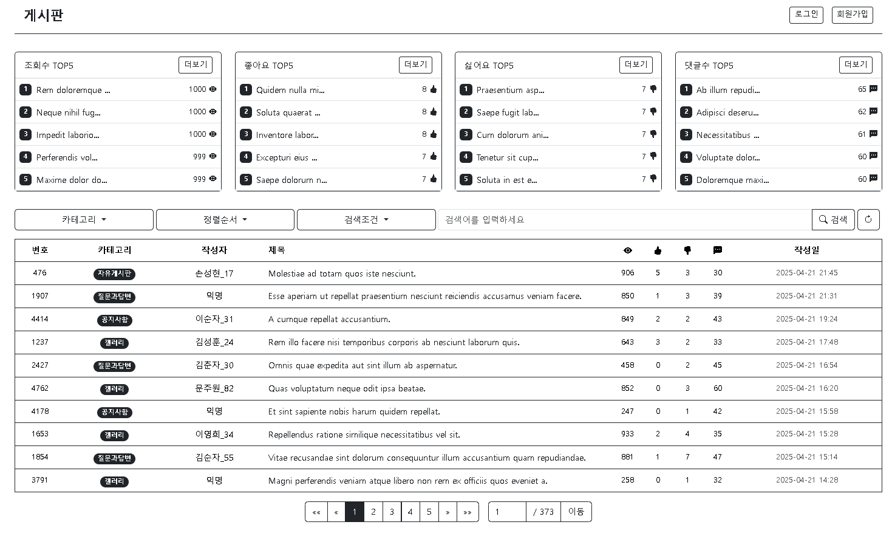

# board
<div align="center">
    
</div>
<div align=center>
	<h3>  <a href="">🌐시연영상</a> </h3>
</div>

<br>

<details>
<summary><b> 📌 프로젝트 개요</b></summary>
<br>

- 스프링 부트 기반 게시판 서비스
- 사용자 인증 및 권한 관리를 통해 게시물, 댓글 작성
- 게시물, 댓글 페이지네이션 및 좋아요, 싫어요
- 게시물 조회수 및 사용자 활동에 따른 스프링 배치 랭킹 집계
- 모듈화된 구조로 API, 배치 처리, 공통 모듈로 개발

</details>

<br>

<details>
<summary><b> 🏃 프로젝트 실행</b></summary>
<br>

  ```bash
  # 프로젝트 클론
  git clone https://github.com/mpqm/spring-service-board.git
  cd spring-service-board
  # DB 실행: Docker 컨테이너 빌드 및 실행
  ./meta/infra/docker-compose up -d
  ./meta/docs/ddl.sql # DDL 적용
  ./meta/docs/data.py # 더미 데이터 적용
  # API 어플리케이션 실행
 ./api/src/main/java/com/board/api/ApiApplication.java
  # 배치 어플리케이션 실행 
  ./batch/src/main/java/com/board/batch/BatchApplication.java
  # http://localhost:8080 접속
  ```

</details>

<br>

<details>
<summary><b> 🚀 프로젝트 설명</b></summary>
<br>

- 회원 기능
    - 회원가입, 이메일 인증, 로그인, 로그아웃 기능 제공
    - 프로필 수정, 계정 비활성화, ID/PW 찾기
- 게시물 기능
    - 게시물 CRUD
    - 게시물 목록 페이지네이션
    - 카테고리, 제목, 내용, 작성자별 검색 기능
    - 게시물 좋아요, 싫어요
    - 게시물 작성자 외 수정, 삭제 제한
    - SummerNote를 이용한 게시글 작성, 이미지 첨부 기능
    - 공개, 비공개, 익명, 보호를 통한 공개 범위 선택
- 댓글 기능
    - 게시물에 대한 댓글 CRUD
    - 댓글 작성자 외 수정, 삭제 제한
    - SummerNote를 이용한 댓글 작성
    - 대댓글 지원 및 대/댓글 페이지네이션
- 반응 기능 
    - 게시물 및 댓글에 대한 좋아요/싫어요 기능
    - 댓글에 대한 좋아요/ 싫어요
- 활동 기능
    - 내가 쓴 게시물, 댓글 관리
    - 내가 누른 좋아요, 싫어요 관리
- 랭킹 기능
    - Spring Batch를 활용한 주기적 랭킹 집계
    - 조회수, 좋아요 수, 댓글 수, 싫어요 등 다양한 지표 기반 랭킹
- 글로벌
    - 예외 처리 및 글로벌 에러 핸들링
    - API 응답 표준화

</details>

<br>

<details>
<summary><b> 🎮 프로젝트 스택 </b></summary>
<br>

| **CATEGORY** | **SKILLS**                                                                                                                                                                                                                                                                                                                                                                                                                       | 
|--------------|----------------------------------------------------------------------------------------------------------------------------------------------------------------------------------------------------------------------------------------------------------------------------------------------------------------------------------------------------------------------------------------------------------------------------------|
| **FRONTEND** |     |
| **BACKEND**  |                                                                                               |
| **DATABASE** |                                                                                                                                                                                                                                                                                                                          |
| **ENVIRONMENT**      |                                                                                                                                                                                                                        |                                                                                                                                                                                                                                                                                                                                                     

</details>

<br>

<details>
<summary><b> 🗄️ 프로젝트 문서 </b></summary>
<br>

| **프로젝트 개발 산출물**  | **링크**                                                                                                           |
|------------------|------------------------------------------------------------------------------------------------------------------|
| 🎡 ERD           | [ERD](https://github.com/mpqm/spring-service-board/wiki/01.-%F0%9F%8E%A1-ERD)                              |
| 🎡 Architecture  | [Architecture](https://github.com/mpqm/spring-service-board/wiki/02.-%F0%9F%8E%A1-Architecture)                     |
| ➰ 요구사항 정의서       | [요구사항 정의서](https://docs.google.com/spreadsheets/d/1OVGWt-4I3hzjtiSwc_WbZRIhS_UiKA0PsSY-jgnLu4s/edit?usp=sharing) |
| 📃 백엔드 API 명세서   | [백엔드 API 명세서](https://www.notion.so/API-261a64eb8b5081e68ac3db22e029838f?source=copy_link)                                                                                            |
| 🌱 프론트엔드 화면 설계서  | [프론트엔드 화면 설계서](https://www.figma.com/design/DSXFJXjccETjkaplS3HMq4/spring-service-board?node-id=8-2&t=lrUcyQsbjGivJr5w-1)                                                                                           |
| 🎥 프로젝트 시연 영상    | [프로젝트 시연 영상](https://github.com/mpqm/spring-service-board/wiki/06.-%F0%9F%8E%A5-%ED%94%84%EB%A1%9C%EC%A0%9D%ED%8A%B8-%EC%8B%9C%EC%97%B0-%EC%98%81%EC%83%81)                                                                                             |
| 🔎 기능 설명 및 성능 개선 | [기능 설명 및 성능 개선](https://github.com/mpqm/spring-service-board/wiki/07.-%F0%9F%94%8E-%EA%B8%B0%EB%8A%A5-%EC%84%A4%EB%AA%85-%EB%B0%8F-%EC%84%B1%EB%8A%A5-%EA%B0%9C%EC%84%A0)                                    |

</details>

<br>
