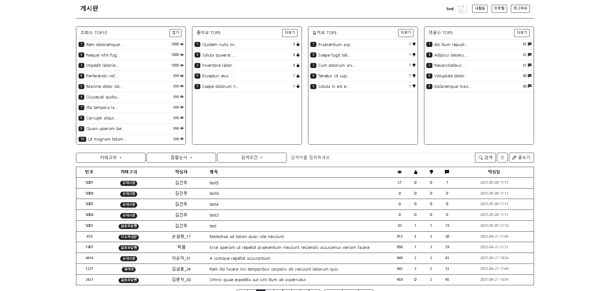

# Spring Batch 활용 랭킹시스템
- 배치 아키텍처
   - Spring Batch 프레임워크 기반으로 별도의 모듈로 분리하여 API 서버와 독립적으로 운영
   - BatchConfig 클래스에서 Chunk 기반의 배치 작업 설정
   - BatchJobRunner 를 통한 배치 작업 실행 및 결과 로깅
- ETL 프로세스 구현
   - RankReader
      - 게시물 데이터를 DB서 청크 단위로 읽어오는 역할
      - 일정 크기(chunkSize)로 데이터를 페이징하여 메모리 효율성 확보
      - 더 이상 읽을 데이터가 없을 때까지 배치 처리 계속
   - RankProcessor
      - 가져온 데이터를 기준별로 처리하는 역할
      - 조회수, 좋아요 수, 싫어요 수, 댓글 수 기준으로 4가지 정렬 수행
      - TreeSet 자료구조를 활용한 상위 10개 게시물 자동 정렬
      - 각 기준(V: 조회수, L: 좋아요, U: 싫어요, C: 댓글)에 따른 랭킹 생성
   - RankWriter
      - 처리된 랭킹 정보를 DB에 저장하는 역할
      - 생성된 랭킹 데이터를 영구 저장
      - 트랜잭션 관리로 데이터 정합성 보장

# 대댓글 시스템
- 댓글-대댓글 구조
   - 기본 댓글과 대댓글을 구분하여 관리
   - 댓글 엔티티에 parentIdx 필드를 사용하여 원본 댓글과 대댓글의 관계 설정
   - 최상위 댓글과 그에 대한 대댓글의 2단계 구조로 간결하게 구현
- 대댓글 기능 구현
   - **CommentController**에서 댓글과 대댓글 API 별도 관리
      - **/comment-list** : 게시물에 대한 최상위 댓글 조회
      - **/reply-list** : 특정 댓글에 대한 대댓글 조회
   - 댓글 작성 시 parentIdx가 null이면 최상위 댓글, 값이 있으면 대댓글로 처리
   - 간단한 2단계 구조로 UI 복잡성과 DB 쿼리 부하 최소화
- 프론트엔드 구현
   - 댓글과 대댓글을 시각적으로 구분하여 표시
   - 댓글 아래 '답글 달기' 버튼을 통해 대댓글 작성 UI 제공
   - 대댓글은 들여쓰기나 시각적 표현으로 구분
- 주요 기능
   - 댓글/대댓글 CRUD 작업 지원
   - 댓글 작성자 인증 및 권한 관리
   - 대댓글도 원 댓글과 동일하게 좋아요/싫어요 기능 지원
   - 페이지네이션을 통한 효율적인 댓글/대댓글 로딩